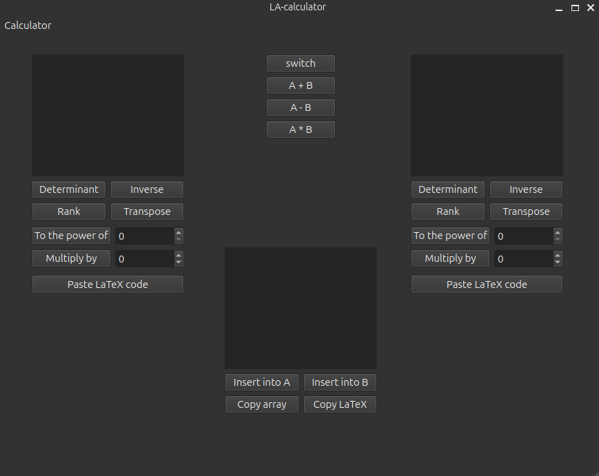
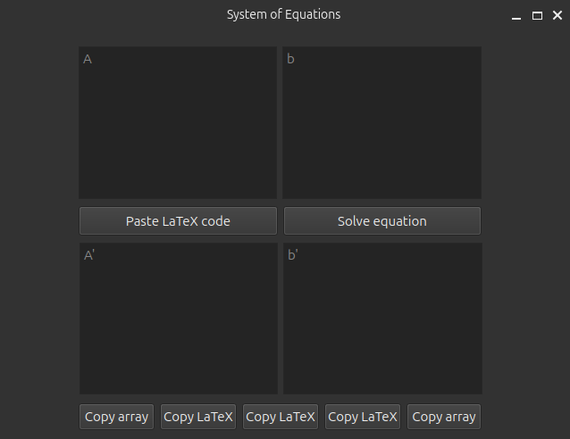
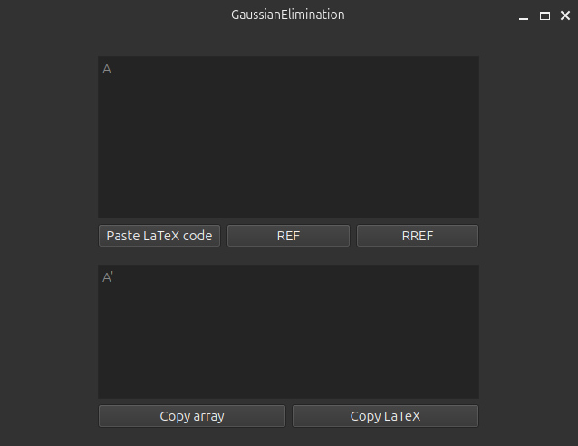
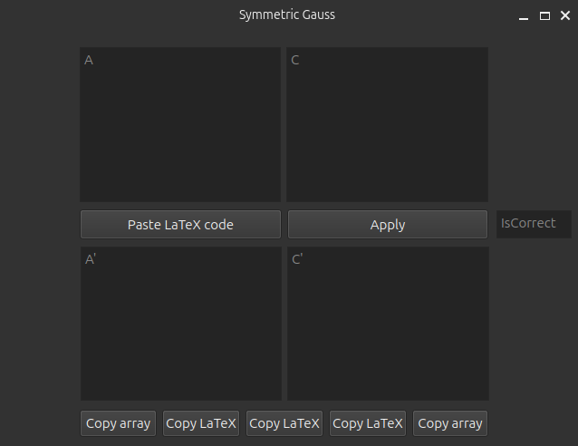

# Installation

Для сборки необходим `qt6-base-dev`, `qmake6`. Установить на `MacOS` их можно (наверное) через `brew`.

```
git clone https://github.com/listens-to-spotify/la-calc
```

```
cd la-calc/app
```

```
qmake6 la-calc.pro
make && make clean
```

Вы получите бинарный файл `la-calc`, который можно запустить вручную:

```
./la-calc
```

или засунуть бинарник в `PATH`:

```
sudo cp la-calc /usr/local/bin/
sudo chmod +x /usr/local/bin/la-calc
```

Теперь можно запустить приложение, просто открыв терминал и написав `la-calc`.

# Interface

### Main Window


### SLE Window


### Gauss Window


### Sym Gauss Window


# Contact

tg: [listens_to_spotify](https://t.me/listens_to_spotify)
