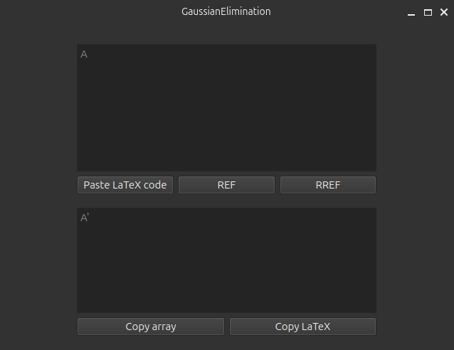

## Install on MacOS

```
git clone https://github.com/listens-to-spotify/la-calc
```

## Auto installation

```
cd la-calc
```
```
bash install-mac.sh
```
```
bash build-mac.sh
```

## Manual Installation

### Installing dependencies

1. `brew`:
```
xcode-select --install
```
Then, in /Applications/Utilities/, run:
```
/bin/bash -c "$(curl -fsSL https://raw.githubusercontent.com/Homebrew/install/HEAD/install.sh"
```
```
echo 'eval "$(/opt/homebrew/bin/brew shellenv)"' >> ~/.zshrc
source ~/.zshrc
```
Check `brew` version:
```
brew --version
```

2. `qt6`:
```
sudo brew install qt6
```
Check `qmake6` verison:
```
qmake6 --version
```

### Build project

```
cd la-calc/app
```
```
qmake6 la-calc.pro
```
```
make
```

Clean unnecessary build files:

```
make clean
```

Give rights to execute `la-calc.app`:

```
chmod a=rwx la-calc.app
```

### Send to Desktop

```
ln -s la-calc.app ~/Desktop/LA-Calculator
```

Then run `la-calc` from desktop.

# Update version

## Auto-update

Run `bash update-mac.sh`

## Manual update

Force update local repo:

```
git remote add https://github.com/listens-to-spotify/la-calc
```

```
git branch
>> * LOCAL_BRANCH_NAME(main expected)
```

```
git fetch --all
git reset --hard origin/LOCAL_BRANCH_NAME
```

Then, rebuild project.

# Interface

### Main Window


### SLE Window


### Gauss Window


### Sym Gauss Window


# Contact

tg: [listens_to_spotify](https://t.me/listens_to_spotify)
